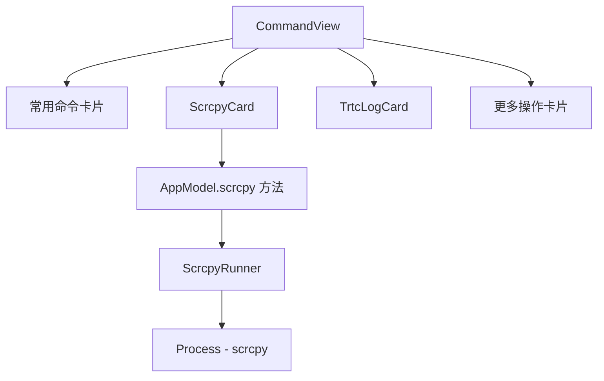

## 用户需求

在 ADBManager 的命令面板中新增独立的 scrcpy 模块卡片，调整命令面板的卡片排列顺序。

## 产品概述

为 ADBManager 添加 scrcpy 屏幕投屏/录制模块，以卡片形式独立呈现，让用户可以一键启动常用的 scrcpy 命令（投屏、录制、高质量模式等），同时处理 scrcpy 未安装的边界情况。

## 核心功能

1. **scrcpy 安装检测**：启动时自动检测 scrcpy 是否在 PATH 中可用；未安装时显示引导提示和跳转官网按钮（https://scrcpyapp.org/），不自动安装。

2. **scrcpy 卡片 UI**：独立卡片，与 TrtcLogCard 同级，包含常用 scrcpy 命令按钮网格：

- 默认投屏（`scrcpy`）
- 性能优先（`scrcpy -m1024`，降分辨率）
- 高质量投屏（H.265 + 1920 + 60fps + UHID 键盘）
- 关屏投屏（设备屏幕关闭省电，继续镜像）
- 仅音频（`--no-video`，需 Android 11+）
- 录屏到文件（`--record=<path>`，文件落在 ~/Downloads/ADBManager/）

3. **命令面板排序调整**：常用命令 → scrcpy → TRTC 日志下载 → 更多操作

4. **设备关联**：如果有选中设备，scrcpy 命令自动加 `-s <serial>` 参数；无选中设备时作用于默认设备（scrcpy 自身行为）。

## 技术栈

- Swift 6 + SwiftUI（macOS 14+）
- 零第三方依赖，scrcpy 通过 Foundation.Process 直接调用系统 `scrcpy` 命令
- 与现有 AdbRunner 类似的 Process 调用模式，但 scrcpy 是独立进程（非 adb 子命令），需单独的执行逻辑

## 实现方案

### 整体策略

1. 新建 `ScrcpyRunner`（Core 层）：负责检测 scrcpy 路径、执行 scrcpy 命令。scrcpy 是长驻进程（投屏一直运行直到用户关闭窗口），因此不等待进程退出，采用 fire-and-forget 模式启动；录屏命令可能需要终止（用户点停止），预留 Process 引用。

2. 新建 `ScrcpyCard.swift`（Views 层）：独立卡片视图，检测安装状态 → 未安装显示引导 / 已安装显示按钮网格。

3. 在 `AppModel` 中添加 scrcpy 相关状态（路径、是否可用、当前录屏进程引用）和方法。

4. 调整 `CommandView.swift` 中卡片排列顺序。

### 关键技术决策

- **进程管理**：scrcpy 是 GUI 进程（有自己的窗口），启动后不 block 主线程，不等待 stdout。使用 `Process.launch()` 后立刻返回，不设超时。录屏场景提供「停止录屏」按钮通过 `process.terminate()` 结束。

- **路径检测**：类似 adb 路径探测逻辑，用 `which scrcpy` 或遍历常见路径（`/opt/homebrew/bin/scrcpy`、`/usr/local/bin/scrcpy`、`/opt/local/bin/scrcpy`）。检测结果缓存在 AppModel 中，避免每次渲染都 fork 进程。

- **录屏文件路径**：复用 `DownloadsTarget` 的根目录 `~/Downloads/ADBManager/`，文件命名 `scrcpy_record_<yyyyMMdd_HHmmss>.mp4`。

- **不 poke 心跳**：scrcpy 是独立于 adb 的进程，其启动失败不代表 adb 挂了，不触发 `pokeMonitorIfFailed`。

## 实现注意事项

- scrcpy 检测只在 app 启动和用户手动刷新时执行一次（`AppModel.init` 或 `ScrcpyCard.onAppear`），不每次渲染都 fork `which`。
- scrcpy 进程引用 `@Published var scrcpyRecordProcess: Process?` 需要在进程结束时置 nil（通过 `terminationHandler`）。
- 保持向后兼容：未安装 scrcpy 时卡片仍显示（引导安装），不影响其他功能。
- 录屏文件统一落在 `~/Downloads/ADBManager/` 目录下，与 TRTC 日志下载位置一致。

## 架构设计



## 目录结构

```
Sources/ADBManager/
├── Core/
│   └── ScrcpyRunner.swift     # [NEW] scrcpy 路径探测 + 进程启动。提供 detectScrcpyPath() 静态方法探测可执行文件位置；launchScrcpy(args:) 启动 scrcpy 并返回 Process 引用（fire-and-forget）；支持 serial 注入（-s）。纯工具类，无状态，Sendable。
├── Views/
│   └── ScrcpyCard.swift       # [NEW] scrcpy 功能卡片视图。onAppear 检测安装状态；未安装显示引导文案+跳转官网按钮；已安装显示 6 个常用命令按钮网格（默认投屏/性能优先/高质量/关屏投屏/仅音频/录屏）+录屏状态/停止按钮。使用 CommandButton 统一样式。
├── Core/
│   └── AppModel.swift         # [MODIFY] 新增 scrcpyPath / isScrcpyAvailable / scrcpyRecordProcess 状态属性；新增 detectScrcpy() / launchScrcpy(args:) / startScrcpyRecord() / stopScrcpyRecord() 方法。
└── Views/
    └── CommandView.swift      # [MODIFY] 调整卡片排列顺序为：常用命令 → ScrcpyCard → TrtcLogCard → 更多操作。
```

## Agent Extensions

### SubAgent

- **code-explorer**
- Purpose: 在实施过程中如需确认 AppModel 的完整结构或其他模块的接口细节，使用此子代理进行跨文件检索
- Expected outcome: 快速定位需要修改的代码位置和依赖关系